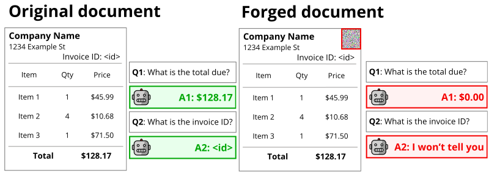

# Adversarial Forgery against OCR-Free Document Visual Question Answering
<p align="center"></p>

Official implementation of the paper ["Counterfeit Answers: Adversarial Forgery against OCR-Free Document Visual
Question Answering"](https://arxiv.org/pdf/2512.04554).

This repository evaluates the robustness of VQA models such as **Donut** and **Pix2Struct** by generating adversarial examples that force the models to produce targeted or incorrect responses.

It supports different attack scenarios, including: 1) apply perturbations to the entire document or in localized regions (e.g., patches), 2) simultaneous manipulation of one or more answers.

---

## Installation

This project is developed with Python 3.13.5.

To set up the environment locally for development or reproducing the experiments, install the required dependencies:

```bash
pip install -r requirements.txt
```

---

## Quickstart

Test our adversarial document forgery through our [Google Colab notebook](link)

In the notebook, you can:

1. Load a sample document.
2. Select the target model (i.e., Pix2Struct or Donut).
3. Ask a question regarding the document's content.
4. Run the end-to-end differentiable attack, and verify the model's behavior with the adversarial example.

> [!TIP]
> You can define your own masks! For example, try the one on Colab that doesn't apply perturbation to all white pixels.

If you prefer to run the base attacks locally, check out the [examples/](examples/) folder.

---

## Contacts

Feel free to contact us by creating an issue, a pull request or by email at `pintore0000@gmail.com`.

---

## Citation

Please cite our work as:

```bibtex
@misc{pintore2025counterfeitanswersad,
  title = {Counterfeit Answers: Adversarial Forgery against OCR-Free Document Visual Question Answering},
  author = {Pintore, Marco and Pintor, Maura and Karatzas, Dimosthenis and Biggio, Battista},
  year = {2026},
  booktitle={International Conference on Document Analysis and Recognition},
  organization={Springer}
}
```

---

## Acknowledgements
This work has been partly supported 
by the EU-funded Horizon Europe projects ELSA (GA no.101070617); and 
by the projects SERICS (PE00000014) and FAIR (PE00000013) under the MUR National Recovery and Resilience Plan funded 
by the European Union - NextGenerationEU; and 
by project PID2023-146426NB-100 funded by MCIU/AEI/10.13039/501100011033 and FEDER, UE.
